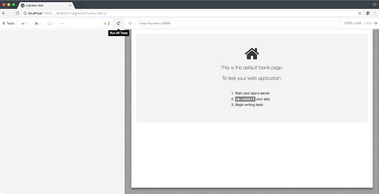
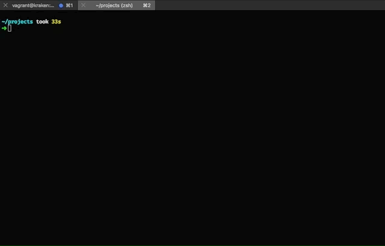
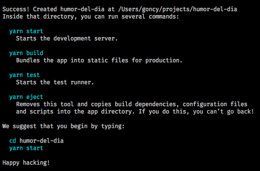
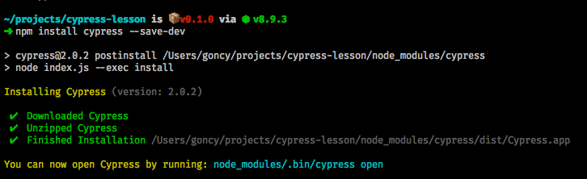
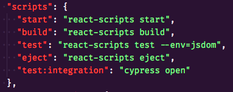
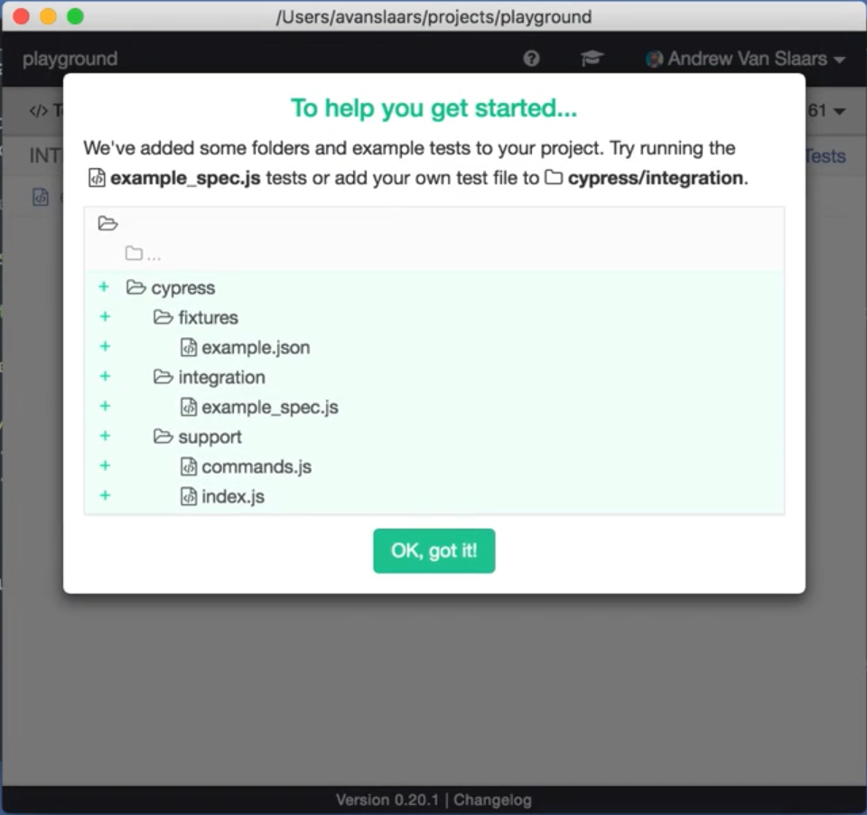

🇪🇸 [Ver esta lección en español](./README.md)

---

# 👋 Hello World!
This project will show you how to make integration tests for your app easily with [Cypress](https://www.cypress.io/).

## What we will do?
We will write some tests for a really simple app, that will show with emojis our current mood depending the day of the week.

> 

(Tip: If you just want to check the code just navigate or clone this repo, as a disclaimer, it's in spanish)

## What's up with Cypress?
Well, is really simple to use and it let me do something that i always tried to do and couldn't (maybe i didn't search a lot), stub the network requests responses. Sometimes we don't have full control of the API so this is really helpful.

> 

## Let's get this party started!

### 🤓 Creating our project
For this project we will use React, so we will use [Create react app](https://github.com/facebook/create-react-app), if you don't have it installed, go to the terminal and run:

```bash
npm install -g create-react-app
```

> 

Once it finished, run:

```bash
create-react-app mood-of-the-day # Or whatever you want to use as name
```

> 

This will install all the necessary dependencies for our project, now open the new folder that was created with your favorite editor. I will use [VSCode](https://code.visualstudio.com/), with my beautiful theme [Styncy](https://marketplace.visualstudio.com/items?itemName=goncy.styncy) (own promotion disclaimer 😛)

### 🕐 Installing Cypress
Once that we already have our project created and opened, we will install Cypress, so, go to the terminal again (ensure that we are on the project directory) and run:

```bash
npm install cypress --save-dev
```

This will install Cypress as a dev dependency, this will take a while because it have to download the Cypress binary, meanwhile, we will continue with the other steps.

> 

### 💫 Editing our app
We will edit our app to show a different mood that we will get from an unexisting API, depending which day of the week is. Open `src/App.js` and replace the content with the following code:

```javascript
import React, { Component } from "react"; // Importing React

import logo from "./logo.svg"; // We will leave the React logo because i like it

import "./App.css"; // Importing the default styles from Create react app

class App extends Component {
  state = {
    mood: null, // Default mood, nothing yet because we didn't do the request
    loading: false, // Loading state
    day: "monday" // Monday as default because it was monday when i wrote this lesson
  };

  getMood = async () => {
    this.setState({loading: true}); // Loading is now true because we are starting the request process

    const req = await fetch("http://mimood.com/mood/" + this.state.day); // Call to the unexistent API
    const mood = await req.text(); // Get the response

    this.setState({ mood, loading: false }); // Saving the mood and restore loading state to false
  };

  render() {
    const { mood, loading } = this.state; // Get mood and loading from our state

    return (
      <div className="App">
        <header className="App-header">
          
          <h1 className="App-title">Welcome to my mood</h1>
        </header>
        <div className="App-intro">
          <select
            onChange={event => this.setState({ day: event.target.value })} // Save the mood to the state when you change options from the select
            name="days"
          >
            <option value="monday">Monday</option>
            <option value="wednesday">Wednesday</option>
            <option value="friday">Friday</option>
          </select>
          {!!mood && <p>{mood}</p> /* Show the mood if there is one */}
          <button onClick={this.getMood} disabled={loading}> {/* Trigger the mood on click, disable the buton if it's loading */}
            Get mood
          </button>
        </div>
      </div>
    );
  }
}

export default App;
```

### ✍️ Creating a Cypress script
Open `package.json` and in line 15, inside scripts, below the `eject` script, paste the following:

```json
"test:integration": "cypress open"
```

> 

This will let us run Cypress when running `npm run test:integration` (Tip: The script can be named whatever you want)

### 🏃‍♂️ Running cypress
Suponiendo que ya termino de instalar, vamos a la terminal nuevamente y ejecutamos:

```bash
npm run test:integration
```

After some seconds a new window will pop up telling us that some default and example files were created.

> 

### 💅Configuring Cypress
The only thing that we need to configure in Cypress is our base URL, so open `cypress.json` and replace it's content with:

```json
{
  "baseUrl": "http://localhost:3000"
}
```

(If your app URL is different just put yours)

### ✏️ Writing our tests
First things first, go to `cypress/integration` and remove the example test and create a new one called `mood.test.js`, inside it past the following code:

```javascript
describe("Mood", () => {
  // Cypress and native web fetch are not friends yet so we need this hack to let Cypress stub our network calls
  before(function() {
    Cypress.on("window:before:load", win => {
      win.fetch = null;
    });
  });

  beforeEach(function() { // This will be executed before each call (duh)
    cy.server(); // Telling Cypress we will use it's server

    cy.route("GET", "/mood/monday", "😰"); // Telling Cypress that each call to /mood/monday, should return 😰
    cy.route("GET", "/mood/wednesday", "😐"); // Telling Cypress that each call to /mood/monday, should return 😐"
    cy.route("GET", "/mood/friday", "😃"); // Telling Cypress that each call to /mood/monday, should return 😃

    cy.visit("/"); // Navigate to App root
  });

  it("should show a sad if it's monday", () => {
    cy.get("[name='days']").select("monday"); // Seleccionamos monday de nuestro listado de days

    cy.contains("Get mood").click(); // Clicking the Get mood button

    cy.contains("😰"); // Check if the app has a 😰
  });

  it("should show a neutral if it's wednesday", () => {
    cy.get("[name='days']").select("wednesday"); // Seleccionamos wednesday de nuestro listado de days

    cy.contains("Get mood").click(); // Clicking the Get mood button

    cy.contains("😐"); // Check if the app has a 😐
  });

  it("should show a happy if it's friday", () => {
    cy.get("[name='days']").select("friday"); // Seleccionamos friday de nuestro listado de days

    cy.contains("Get mood").click(); // Clicking the Get mood button

    cy.contains("😃"); // Check if the app has a 😃
  });
});
```

### 👟 Running our tests
Back in Cypress main screen, click on `mood.test.js` and wait for the tests to complete.

### 🎉 Done!
Congrats! Now you have your small app tested with Cypress

___
### 🗣 And now?
Our tests pass!, but our app doesn't work, this is because our server doesn't exists, Cypress is simulating it, if you want to make it work, you can try with [micro](https://github.com/zeit/micro) or [json server](https://github.com/typicode/json-server), but this is out of this lesson 😛

Cypress has a lot of cool things to try, you can find more information on it's 📚[documentation](https://docs.cypress.io/)

## 📚 More lessons
* [Recompose](https://github.com/goncy/recompose-lesson)
* [Ramda](https://github.com/goncy/ramda-lesson)
---
*If you find something wrong, please, let me know or do a PR!*

**by [@goncy](http://github.com/goncy)**