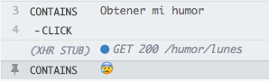
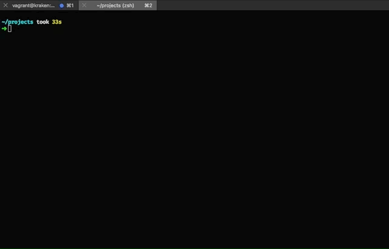
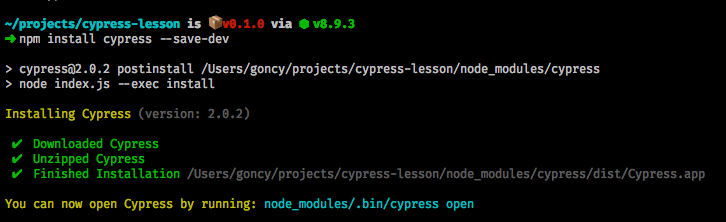
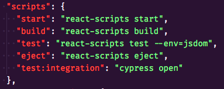
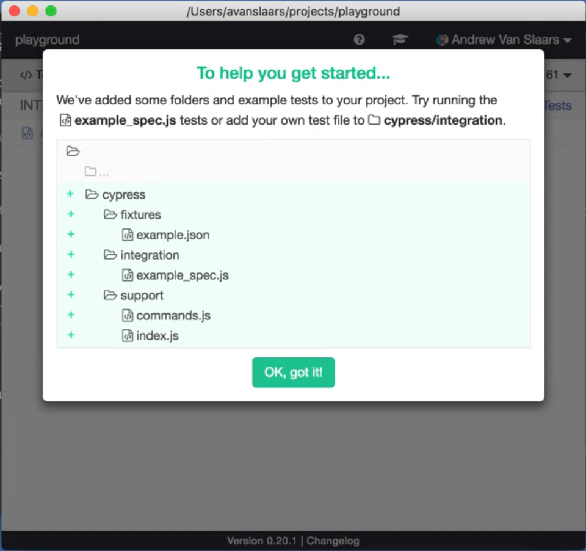

🇺🇸🇬🇧 [See this lesson in english](./README-EN.md)

---

# 👋 Hola mundo!

Este proyecto te va a mostrar como hacer tests de integración fáciles para tu app con [Cypress](https://www.cypress.io/), decidí hacerlo en español por que hay mucha gente que le interesa este tema y no tiene conocimientos de inglés, asi que aportamos un poco a la comunidad latina 💪

## Qué vamos a hacer?
Vamos a armar tests para una app muuuy simple, que nos va a mostrar con emojis cuál es nuestro humor según el día que elijamos de una lista.

> 

(Tip: Si simplemente queres ver el código, podes navegar o clonar este repo, tiene todo terminado y funcionando)

## Qué tiene de loco Cypress?
Bueno, además de ser muy simple de usar me permitió hacer de forma fácil algo que siempre pensé hacer y nunca pude (o no busqué bien), elegir que devuelven los llamados http que hago dentro de mi app. Muchas veces nosotros no tenemos control de lo que devuelve nuestra API (por que usa datos externos, por que no nos pertenece, etc), entonces esto es algo muy importante para asegurarnos de que nuestros features funcionan sin preocuparnos por el servidor.

> 

## Vamos a empezar!

### 🤓 Creando nuestro proyecto
Para este ejemplo vamos a usar React, para eso vamos a ayudarnos con [Create react app](https://github.com/facebook/create-react-app), si no la tenés instalada, andá a la terminal y ejecutá:

```bash
npm install -g create-react-app
```

> 

Una vez que ya terminó de instalar, volvé a la terminal y ejecutá:

```bash
create-react-app humor-del-dia # O el nombre que quieras para tu proyecto
```

> 

Esto va a instalar todas las dependencias que nuestro proyecto necesita, mientras hace esto, vamos a abrir la carpeta que nos creó en nuestro editor favorito. Yo voy a usar [VSCode](https://code.visualstudio.com/), con mi lindo theme [Styncy](https://marketplace.visualstudio.com/items?itemName=goncy.styncy) (disclaimer de auto promoción 😛)

### 🕐 Instalando Cypress
Una vez que tenemos nuestro proyecto creado y abierto, vamos a instalar Cypress, para eso, dirigite a la consola (asegurate de estar dentro del directorio del proyecto) y ejecutá:

```bash
npm install cypress --save-dev
```

Eso va a instalar Cypress como una dependencia de desarrollo, esto va a tardar un rato ya que tiene que bajar el binario. Mientras tanto seguimos con los otros pasos.

> 

### 💫 Editando nuestra app
Vamos a editar nuestra app para mostrar un humor que obtenemos de una API (que no existe) dependiendo del día que sea. Para eso abrimos el archivo `src/App.js` y reemplazamos su contenido por:

```javascript
import React, { Component } from "react"; // Importamos React

import logo from "./logo.svg"; // Dejamos el logito de React que viene por defecto, queda lindo

import "./App.css"; // Importamos los estilos que trae Create react app por defecto

class App extends Component {
  state = {
    humor: null, // Humor por defecto, nada por que no lo pedimos todavia
    cargando: false, // Cargando en false por que todavía no hicimos ningun pedido al servidor
    dia: "lunes" // Lunes por defecto por que hoy es lunes (por lo menos para mí)
  };

  obtenerHumor = async () => {
    this.setState({cargando: true}); // Cargando en true por que empezamos a hacer nuestro pedido

    const req = await fetch("http://mihumor.com/humor/" + this.state.dia); // Hacemos el pedido a una API que no existe
    const humor = await req.text(); // Nos traemos la respuesta

    this.setState({ humor, cargando: false }); // Guardamos la respuesta en "humor" de nuestro estado y ponemos cargando en false
  };

  render() {
    const { humor, cargando } = this.state; // Nos traemos humor y cargando de nuestro estado

    return (
      <div className="App">
        <header className="App-header">
          
          <h1 className="App-title">Bienvenido a mi humor según el día</h1>
        </header>
        <div className="App-intro">
          <select
            onChange={event => this.setState({ dia: event.target.value })} // Cuando el usuario cambie de día, nos guardamos el nuevo día en el estado
            name="dias"
          >
            <option value="lunes">Lunes</option>
            <option value="miercoles">Miercoles</option>
            <option value="viernes">Viernes</option>
          </select>
          {!!humor && <p>{humor}</p> /* Mostramos el humor solo si hay uno */}
          <button onClick={this.obtenerHumor} disabled={cargando}> {/* Cuando hacemos click obtenemos el humor, el boton esta deshabilitado mientras se busca */}
            Obtener mi humor
          </button>
        </div>
      </div>
    );
  }
}

export default App;
```

### ✍️ Creamos un script para correr Cypress
Vamos al archivo `package.json` y en la linea 15, dentro de scripts, debajo del script `eject` pegamos lo siguiente:

```json
"test:integration": "cypress open"
```

> 

Esto nos va a permitir ejecutar Cypress al correr `npm run test:integration` (Tip: El script se puede llamar como quieras)

### 🏃‍♂️ Corremos cypress
Suponiendo que ya termino de instalar, vamos a la terminal nuevamente y ejecutamos:

```bash
npm run test:integration
```

Despues de unos segundos se nos va a abrir una ventana, avisandonos que se crearon varios archivos por defecto de ejemplo.

> 

### 💅Configurando Cypress
Lo único que tenemos que configurar de Cypress, es nuestra URL base, es decir, la URL de nuestra app, para eso vamos a `cypress.json` y reemplazamos su contenido por:

```json
{
  "baseUrl": "http://localhost:3000"
}
```

(Si la URL de tu app es diferente, cambiá la URL para que sea la misma)

Estamos listo para escribir nuestros test!

### ✏️ Escribiendo nuestros tests
Lo primero que vamos a hacer es ir a `cypress/integration`, borrar el test de prueba y crear un archivo llamado `humor.test.js` (siempre dentro de `cypress/integration`), dentro de ese archivo vamos a pegar lo siguiente:

```javascript
describe("Humor", () => {
  // Este hack es necesario por que Cypress no se lleva muy bien con el fetch nativo del browser, con suerte no lo vamos a necesitar en un futuro, basicamente reemplaza el fetch nativo por null para poder reemplazarlo con el fetch de cypress, esto va a servir para poder decidir que van a devolver nuestros calls http
  before(function() {
    Cypress.on("window:before:load", win => {
      win.fetch = null;
    });
  });

  beforeEach(function() { // Esto se va a ejecutar antes de CADA TEST
    cy.server(); // Le decimos a Cypress que vamos a hacer uso de su server

    cy.route("GET", "/humor/lunes", "😰"); // Le decimos a Cypress que cada pedido http dentro de nuestra app a /humor/lunes, debe devolver 😰
    cy.route("GET", "/humor/miercoles", "😐"); // Le decimos a Cypress que cada pedido http dentro de nuestra app a /humor/lunes, debe devolver 😐"
    cy.route("GET", "/humor/viernes", "😃"); // Le decimos a Cypress que cada pedido http dentro de nuestra app a /humor/lunes, debe devolver 😃

    cy.visit("/"); // Le decimos a Cypress que vaya al inicio de nuestra app
  });

  it("debería devolver una cara triste si es lunes", () => {
    cy.get("[name='dias']").select("lunes"); // Seleccionamos lunes de nuestro listado de dias

    cy.contains("Obtener mi humor").click(); // Clickeamos el boton de obtener humor

    cy.contains("😰"); // Esperamos que la app contenga 😰
  });

  it("debería devolver una cara neutral si es miercoles", () => {
    cy.get("[name='dias']").select("miercoles"); // Seleccionamos miercoles de nuestro listado de dias

    cy.contains("Obtener mi humor").click(); // Clickeamos el boton de obtener humor

    cy.contains("😐"); // Esperamos que la app contenga 😐
  });

  it("debería devolver una cara felíz si es viernes", () => {
    cy.get("[name='dias']").select("viernes"); // Seleccionamos viernes de nuestro listado de dias

    cy.contains("Obtener mi humor").click(); // Clickeamos el boton de obtener humor

    cy.contains("😃"); // Esperamos que la app contenga 😃
  });
});
```

### 👟 Corriendo nuestros tests
Volvemos a la pantalla de Cypress, hacemos click en `humor.test.js` y esperamos que se ejecuten los tests.

### 🎉 Listo!
Felicitaciones! Ya tenes tu pequeña app testeada con Cypress

___
### 🗣 Y ahora que?
Ahora nuestros tests pasan!, pero nuestra app no funciona 😭, esto es por que nuestro server no existe y lo simulamos con Cypress. Si queres hacerlo funcionar podrías probar con [micro](https://github.com/zeit/micro) o [json server](https://github.com/typicode/json-server), pero eso ya esta fuera de esta lección 😛

Cypress tiene muchas cosas para probar y hacer, podes investigar un poco su 📚[documentación](https://docs.cypress.io/) y empezar a testear tus apps!

## 📚 Más lecciones
* [Recompose](https://github.com/goncy/recompose-lesson)
* [Ramda](https://github.com/goncy/ramda-lesson)
---
*Si encontras un error, typo, cagada, moco o calificativo negativo, avisame o haceme un PR, gracias!*

**by [@goncy](http://github.com/goncy)**